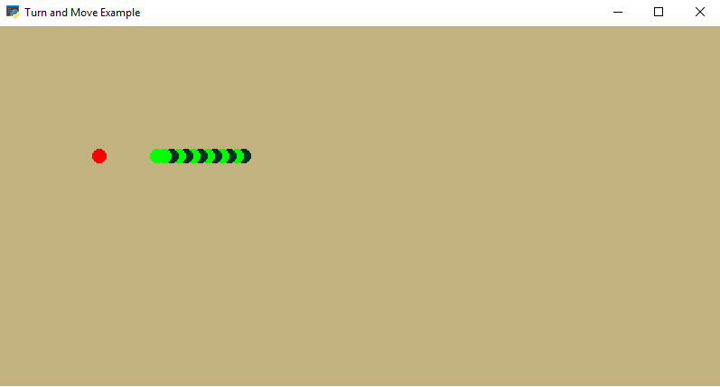

# **Snake Machine Learning**

## Discription 

This is a snake game project designed in Python language and with the Arcade library for neural network training.


 ## How to install 

``` 
pip install -r requirments.txt
```


 ## How to run
 1. **Generate dataset:**

 The snake moves automatically and the information is saved in dataset.csv file.

 you can type below command in terminal to run this file:    

```
python generate_dataset.py
```

 2. **Train naural network:**
    
  to the neural network through dataset.csv file

  you can type below command in terminal to run this file:    

```
python train.py
```

 
|  loss test   | accuracy test      |
| :---         | :---               |
|  0.0228     | 0.99           |


 3. **Play game:**

   you can type below command in terminal to run this file:    

```
python main_ml.py
```
###  picture below is the output of the snake game with a neural network 
  



  

